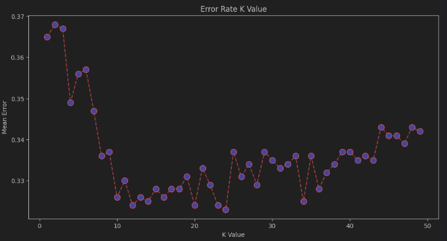
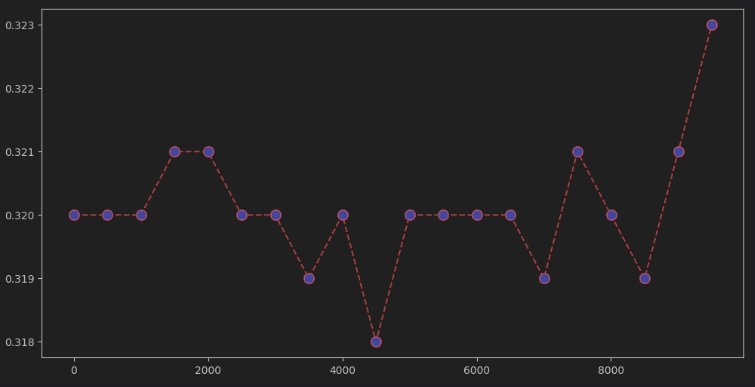

# Kaggle Continuous Contest Submissions

These were my entries for a continuous contest on Kaggle. I used a variety of algorithms, including linear regression, KNN, and RFC. I had the most success with linear regression, netting a score of 0.73, and the least success with KNN, with a score of 0.71.

## Linear Regression
Score: **0.73**

## K-Nearest Neighbors (KNN)
Score: **0.71**

## Random Forest Classifier (RFC)
Score: **0.72**

